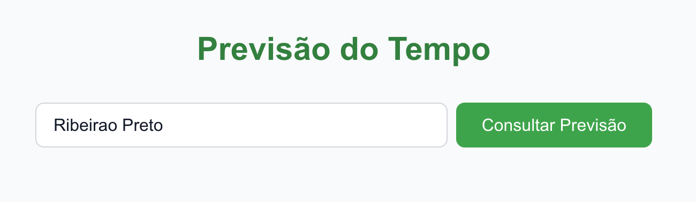
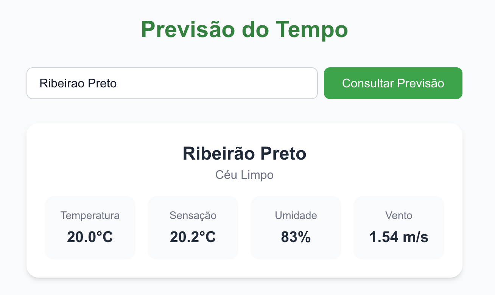
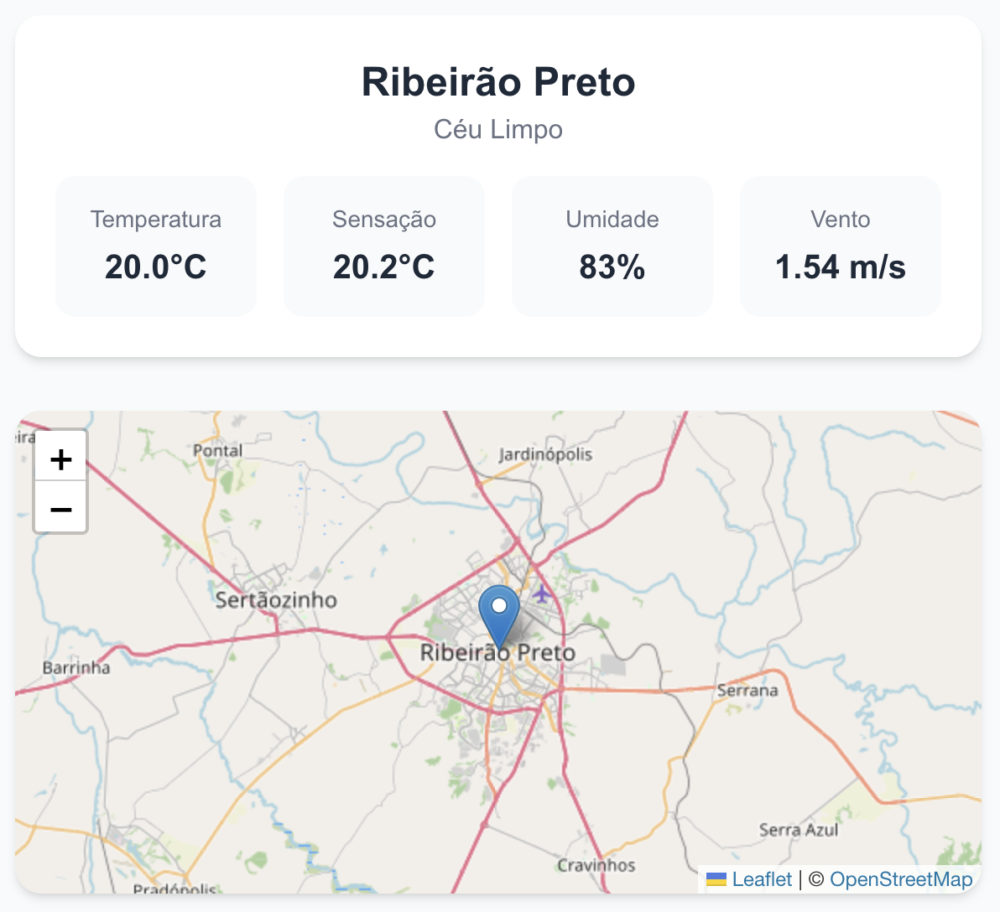
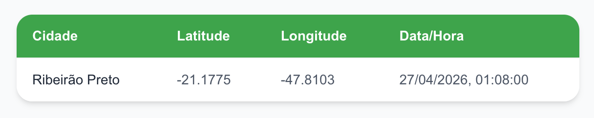
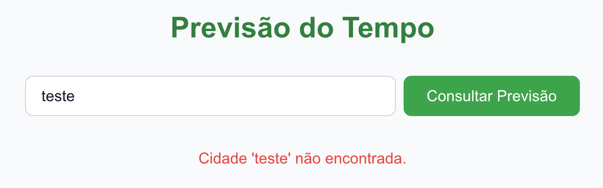

# Weather App — Frontend

Projeto desenvolvido com Next.js e TypeScript para consulta de previsão do tempo.

## Tecnologias

- Next.js 16
- TypeScript
- Tailwind CSS
- Leaflet / React Leaflet
- React Testing Library + Jest

## Pré-requisitos

- Node.js 18 ou superior
- Backend rodando em `http://localhost:8000`

## Instalação

**1. Acesse a pasta do frontend**
```bash
cd weather-app-frontend
```

**2. Instale as dependências**
```bash
npm install
```

## Como rodar

```bash
npm run dev
```

A aplicação estará disponível em `http://localhost:3000`.

## Testes

```bash
npm test
```

## Demonstração







